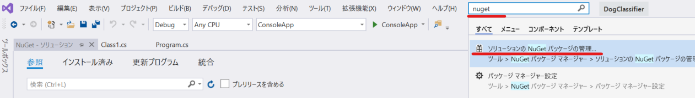
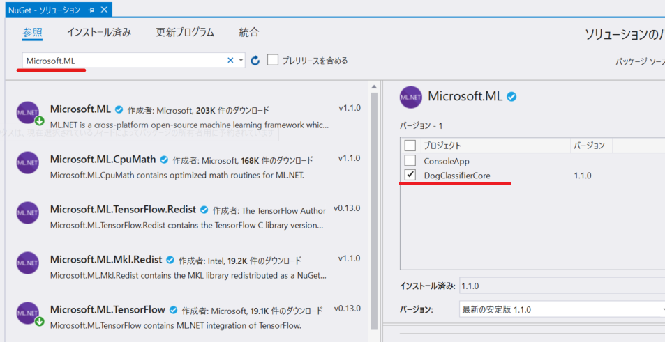
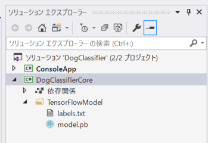
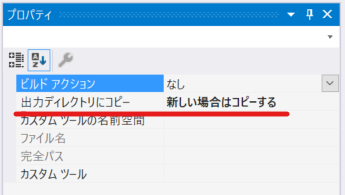
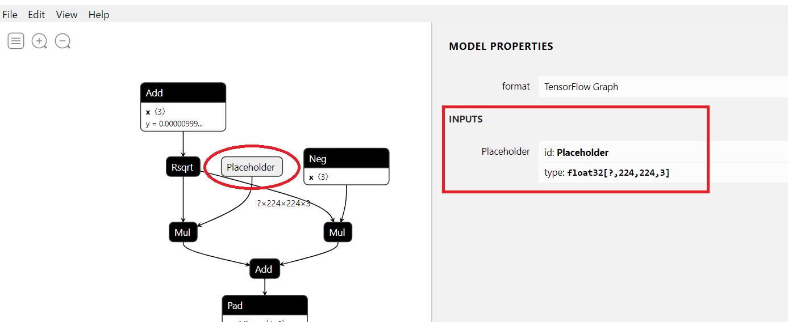
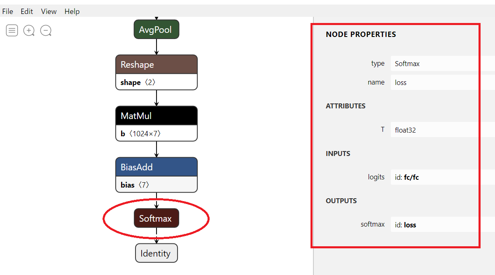
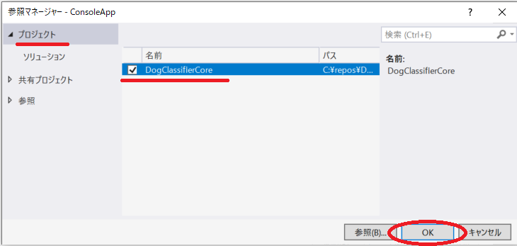
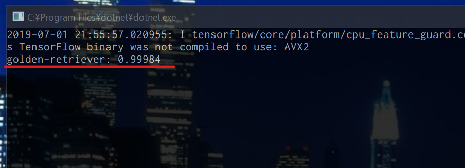

# Chapter 2. TensorFlow + [ML.NET](https://dotnet.microsoft.com/apps/machinelearning-ai/ml-dotnet) で画像分類のコンソールアプリを開発

この Chapter では、Custom Vision Service でエクスポートした TensorFlow のモデルを利用し、Console App で、オフラインで画像分類ができるアプリを開発します。

## [ML.NET](https://dotnet.microsoft.com/apps/machinelearning-ai/ml-dotnet) について

[ML.NET](https://dotnet.microsoft.com/apps/machinelearning-ai/ml-dotnet) を利用すると、.NET アプリケーションで機械学習を行ったり、学習済みのモデルを読み込んで機械学習を行うことができます。  
ここでは、Chapter 1 で Custom Vision Service からエクスポートした TensorFlow のモデルを使って、画像分類ができるコンソールアプリを開発します。

&nbsp;

## STEP2-1 プロジェクトの作成

Visual Studio 2019 を起動し、**新しいプロジェクトを作成** をクリックしプロジェクトを作成します。2つのプロジェクトを作成します。

- コンソールアプリ（.NET Core）
- クラス ライブラリ（.NET Standard）

&nbsp;

まず、コンソールアプリのプロジェクトを作成します。

- プロジェクトのテンプレートは、**コンソールアプリ（.NET Core）** を選択します。
- 「プロジェクト名」に **ConsoleApp"** と入力します。
- 「場所」は任意の場所を入力します。
- 「ソリューション名」に **DogClassifier** と入力します。

&nbsp;

次に、クラスライブラリのプロジェクトを作成します。これは、次の Chapter でも再利用するために コンソールアプリと分けています。

- ソリューションエクスプローラのソリューション名を右クリック > **追加** > **新しいプロジェクト** をクリック
- プロジェクトのテンプレートは、**クラス ライブラリ（.NET Standard）** を選択します。
- 「プロジェクト名」には、**DogClassifierCore** と入力します。
- 「場所」は任意の名称を入力します。

&nbsp;

### Nuget パッケージのインストール

[ML.NET](https://dotnet.microsoft.com/apps/machinelearning-ai/ml-dotnet) を利用する上で必要となる Nuget パッケージをインストールします。  
Visual Studio のショートカットキー `Ctrl` + `Q` をクリックし、「nuget」と入力し、「ソリューションのNugetパッケージの管理」をクリックします。



&nbsp;

**DogClassifierCore** のプロジェクトに、以下4つのパッケージをインストールします。検索にパッケージ名を入力してインストールしましょう。

- **Microsoft.ML**
- **Microsoft.ML.TensorFlow**
- **Microsoft.ML.ImageAnalytics**
- **System.Drawing.Common**



&nbsp;

## STEP2-2 **DogClassifierCore** プロジェクトの実装

まず、**DogClassifierCore** のプロジェクトを右クリック > 追加 > **フォルダ** をクリックして、フォルダを追加します。フォルダ名は、「TensorFlowModel」とします。

また、自動生成された `Class1.cs` のファイルは削除します。

&nbsp;

### TensorFlow の Model の利用準備

次に、Chapter.1 にて、Custom Vision Service でエクスポートしたモデルの zip ファイルを解凍します。解凍すると、以下2つのファイルが出力されます。

- labels.txt
- model.pb

これらを前述で作成したフォルダ「TensorFlowModel」にドラッグ & ドロップで追加します。



&nbsp;

ファイルを置いたら、`labels.txt` を右クリック > **プロパティ** > **出力ディレクトリにコピー** の値を「新しい場合はコピーする」にします。`model.pb` も同様に設定します（2ファイル同時に選択して設定もできます）。



&nbsp;

ここで参考までに、[Netron](https://electronjs.org/apps/netron) というツールを使って、今回利用するモデルがどうなっているかを確認してみます。

> ここでは、確認した結果の概要を説明するだけですが、興味のある方は、後日、自身でダウンロードして確認してみましょう。

モデルの最初の方を確認すると、インプットとなる部分の id は **Placeholder** で、typeは**float32[None, 244,224, 3] であることがわかります。



&nbsp;

また、モデルの最後の方を確認すると、出力の id が **loss** であることがわかります。



&nbsp;

これらの値は、以降の実装で利用します。

### TensorFlow のモデルの定義ファイルを追加

TensorFlow のモデルを利用する際に必要な設定を格納します。先ほど Netron で確認した値も利用します。

**DogClassifierCore** のプロジェクト上で右クリック > **追加** > **クラス** をクリックし、`TensorFlowModelSettings.cs` というファイル名でクラスを追加し、以下のように実装します。

```cs
namespace DogClassifierCore
{
    public struct TensorFlowModelSettings
    {
        public const string InputColumnName = "Placeholder";
        public const int InputImageWidth = 224;
        public const int InputImageHeight = 224;
        public const bool InterleavePixelColors = true;
        public const string OutputColumnName = "loss";
    }
}
```

&nbsp;

### 入力データ、出力結果の class を追加

予測する画像データを格納する class を追加します。

**DogClassifierCore** のプロジェクト上で右クリック > **追加** > **クラス** をクリックし、`InputImage.cs` というファイル名でクラスを追加し、以下のように実装します。

```cs
using System.Drawing;
using Microsoft.ML.Transforms.Image;

namespace DogClassifierCore
{
    public class InputImage
    {
        [ImageType(TensorFlowModelSettings.InputImageHeight, TensorFlowModelSettings.InputImageWidth)]
        public Bitmap Image { get; set; }

        public static InputImage Create(string imagePath)
        {
            return new InputImage()
            {
                Image = (Bitmap) System.Drawing.Image.FromFile(imagePath)
            };
        }
    }
}
```

&nbsp;

次に予測した結果を格納する class を追加します。

**DogClassifierCore** のプロジェクト上で右クリック > **追加** > **クラス** をクリックし、`PredictionResult.cs` というファイル名でクラスを追加し、以下のように実装します。

```cs
using Microsoft.ML.Data;

namespace DogClassifierCore
{
    public class PredictionResult
    {
        [ColumnName(TensorFlowModelSettings.OutputColumnName)]
        public float[] Scores { get; set; }
    }
}
```

&nbsp;

### `ModelConfigurator` class の追加

**DogClassifierCore** のプロジェクト上で右クリック > **追加** > **クラス** をクリックし、`ModelConfigurator.cs` というファイル名でクラスを追加し、以下のように実装します。

```cs
using Microsoft.ML;
using System;
using System.Collections.Generic;
using System.Drawing;
using System.IO;
using System.Linq;

namespace DogClassifierCore
{
    public class ModelConfigurator
    {
        private readonly MLContext _mlContext;
        private static readonly string TensorFlowModelBasePath = Path.Combine(Environment.CurrentDirectory, "TensorFlowModel");
        private static readonly string TensorFlowModelLocation = Path.Combine(TensorFlowModelBasePath, "model.pb");
        private static readonly string TensorFlowLabelsLocation = Path.Combine(TensorFlowModelBasePath, "labels.txt");

        private static string[] _labels;
        private ITransformer _mlModel;
        private readonly PredictionEngine<InputImage, PredictionResult> _predictionEngine;

        public ModelConfigurator(MLContext mlContext)
        {
            _mlContext = mlContext;
            _mlModel = CreateMlModel();
            _predictionEngine = mlContext.Model.CreatePredictionEngine<InputImage, PredictionResult>(_mlModel);
            _labels = File.ReadAllLines(TensorFlowLabelsLocation);
        }


        public string Predict(InputImage inputImage)
        {
            var scores = _predictionEngine.Predict(inputImage).Scores;
            var best =  scores.Max();
            var bestScore = best.ToString("F5");

            var resultText = $"{_labels[scores.AsSpan().IndexOf(best)]}: {bestScore}";
            return resultText;
        }


        private ITransformer CreateMlModel()
        {
            var pipeline = _mlContext.Transforms.ResizeImages(
                    outputColumnName: TensorFlowModelSettings.InputColumnName,
                    imageWidth: TensorFlowModelSettings.InputImageWidth,
                    imageHeight: TensorFlowModelSettings.InputImageHeight,
                    inputColumnName: nameof(InputImage.Image))
                .Append(_mlContext.Transforms.ExtractPixels(
                    outputColumnName: TensorFlowModelSettings.InputColumnName,
                    interleavePixelColors: TensorFlowModelSettings.InterleavePixelColors
                ))
                .Append(_mlContext.Model.LoadTensorFlowModel(TensorFlowModelLocation)
                    .ScoreTensorFlowModel(
                        outputColumnNames: new[] { TensorFlowModelSettings.OutputColumnName },
                        inputColumnNames: new[] { TensorFlowModelSettings.InputColumnName },
                        addBatchDimensionInput: false));

            var model = pipeline.Fit(GetEmptyDataView());
            return model;
        }


        private IDataView GetEmptyDataView()
        {
            var enumerableData = new List<InputImage>
            {
                new InputImage()
                {
                    Image = new Bitmap(TensorFlowModelSettings.InputImageWidth, TensorFlowModelSettings.InputImageHeight)
                }
            };
            return _mlContext.Data.LoadFromEnumerable(enumerableData);
        }
    }
}
```

&nbsp;

簡単にコードを解説します。

> #### コンストラクター:  `public ModelConfigurator(MLContext mlContext)`
> この `ModelConfigurator` class のインスタンス生成時に  `_predictionEngine` 変数 （`PredictionEngine<InputImage, PredictionResult>` 型） を生成しています。これは、画像分類をするためのオブジェクトです。  
この作成の設定は、`CreateMlModel()` メソッドで行っています。  

&nbsp;

> ####  `CreateMlModel()` メソッド  
> 処理の流れとして、パイプラインを作り、`Fit` メソッドを呼んでモデルを生成するという、Python のライブラリなどでモデルを作成するときと類似の流れとなっています。  
モデルが期待する画像のフォーマットに適応させるための `ResizeImages` メソッド、画像から Pixel の値を加工・抽出する `ExtractPixels` メソッドを利用しています。これらの処理は利用する学習モデルに応じて多種多様な設定をすることになります。  
また、`LoadTensorFlowModel` メソッドでモデルをロードします。  
`Fit` メソッドは、一般的には、学習したいデータを渡して学習するものですが、今回は学習済みのモデルをそのまま利用するため、空のデータを渡してモデルを生成しています。 

&nbsp;

詳細に興味がある方は、以下の公式ドキュメントをご参照ください。

- [ResizeImages メソッド](https://docs.microsoft.com/en-us/dotnet/api/microsoft.ml.imageestimatorscatalog.resizeimages?view=ml-dotnet)
- [ExtractPixels メソッド](https://docs.microsoft.com/en-us/dotnet/api/microsoft.ml.imageestimatorscatalog.extractpixels?view=ml-dotnet)
- [LoadTensorFlowModel メソッド](https://docs.microsoft.com/en-us/dotnet/api/microsoft.ml.tensorflowcatalog.loadtensorflowmodel?view=ml-dotnet-preview&viewFallbackFrom=ml-dotnet)
- [ML.NET APIs 全般](https://docs.microsoft.com/en-us/dotnet/api/microsoft.ml?view=ml-dotnet)

&nbsp;

## STEP2-3 ConsoleApp から呼び出す

### 参照の追加

**ConsoleApp** プロジェクトを右クリック > **追加** > **参照** をクリックします。  
左ペインで **プロジェクト** をクリックし、**DogClassifierCore** にチェックを入れて **OK** ボタンをクリックします。  
これで、**ConsoleApp** プロジェクトから **DogClassifierCore** プロジェクトが参照できるようになります。



&nbsp;

### Program.cs の実装

**ConsoleApp** プロジェクトの `Program.cs` を開き、以下のように実装しましょう。  
注意として、 `inputImagePath` には、自身のファイルパスを入力しましょう。

```cs
using System;
using DogClassifierCore;
using Microsoft.ML;

namespace ConsoleApp
{
    class Program
    {
        static void Main(string[] args)
        {}
            var mlContext = new MLContext();
            var modelConfigurator = new ModelConfigurator(mlContext);


            // TODO !!!!! Chapter.1でダウンロードした画像の中で、testset のファイルのフルパスを入力してください。
            var inputImagePath = @"C:\Users\yokohama\Desktop\dogs\dogs\testset\n02099601_3004.jpg";


            var inputImage = InputImage.Create(inputImagePath);

            var result = modelConfigurator.Predict(inputImage);
            Console.WriteLine(result);

            Console.ReadKey();
        }
    }
}
```

ローカルにあるファイルを読み込み、分類器で予測した結果をコンソールに表示できるようになりました。

&nbsp;

## STEP2-4 デバッグ実行で動作確認

**ConsoleApp** の `Program.cs` を実装後、コード内のコメントにあるファイルのフルパスを `inputImagePath` 変数に代入したことを確認しましょう。  

確認したら、`F5` キーを押してデバッグ実行してみましょう。以下のように予測結果が表示されたら、正常に動作しています。



&nbsp;

## NEXT

**おめでとうございます！**:star2:  
Custom Vision で学習した犬の画像分類の学習モデルを ML.NET を利用して読み込み、コンソールアプリで画像の分類ができるようになりました。

ここでは、1つのファイルの結果を予測し、TOP 1の結果を返す実装をしましたが、応用することで複数ファイルを分析したり、上位Nこの結果を返すことも容易に可能です。

次の Chapter では、 ASP.NET Core を利用して画像分類ができる WebAPI を開発します。

---

[戻る](./docs/01_create-custom-vision.md) | [次へ進む](./03_create-aspnetcore-app.md)