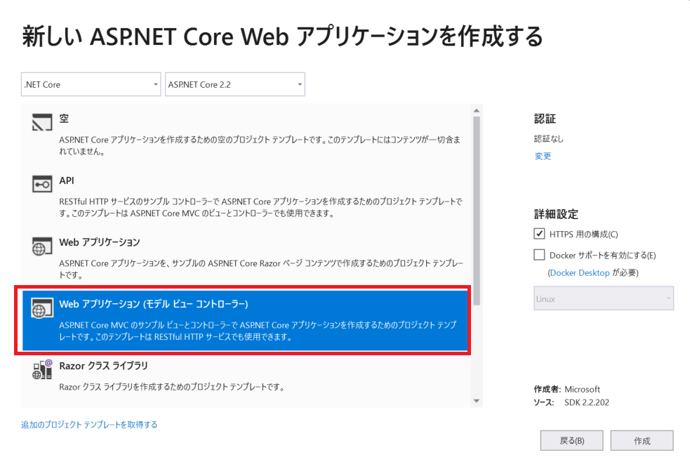
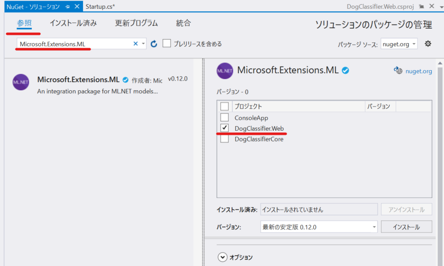
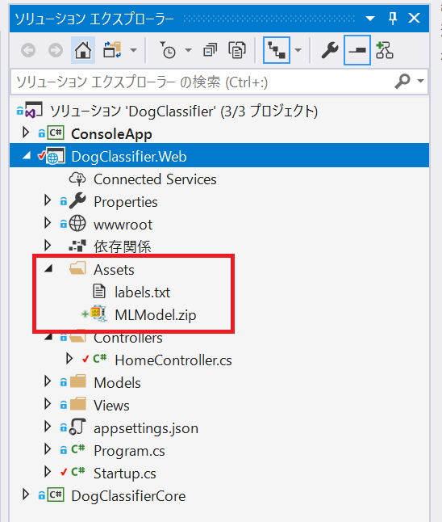
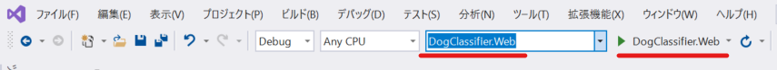
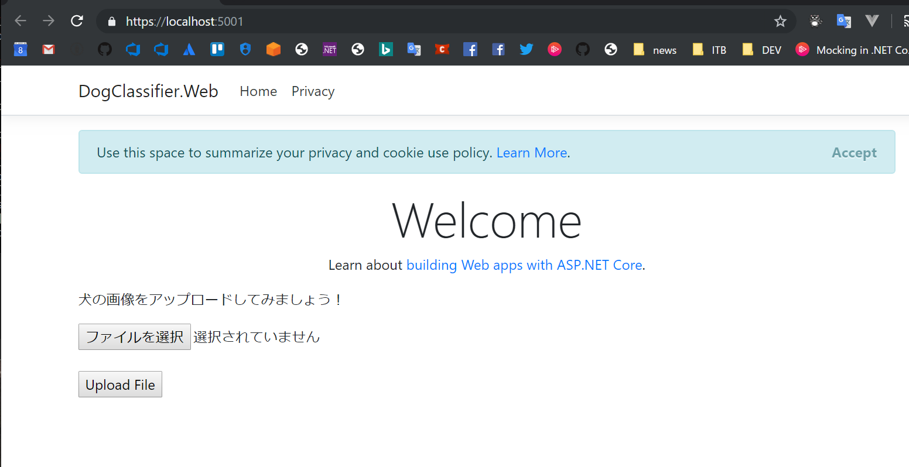
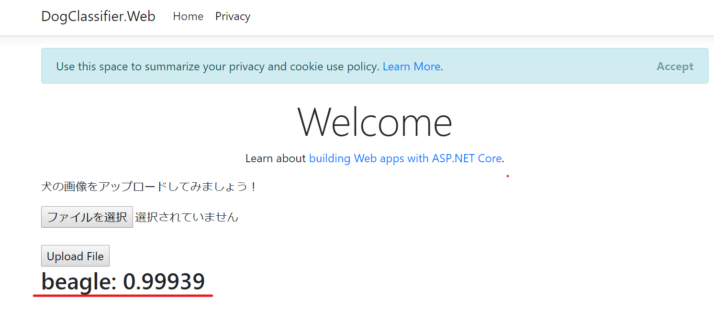

# Chapter 3. TensorFlow + ML.NET + ASP.NET Core で画像分類の Web アプリを開発

この Chapter では、Custom Vision Service でエクスポートした TensorFlow のモデルを利用し、画像分類ができる ASP.NET Core の Web アプリを開発します。

## ASP.NET Core で ML.NET を利用する際の注意

前 Chapter では、`PredictionEngine` 型のオブジェクトを使って、コンソールアプリで画像分類を行いました。しかし、このオブジェクトはスレッドセーフではありません。Web アプリでは複数のスレッドからオブジェクトが読み込まれるため、スレッドセーフであることやパフォーマンスの考慮が必要になります。

この問題を解決するため、`PredictionEnginePool` を利用して実装を行います。

&nbsp;

## STEP3-1 **DogClassifierCore** のプロジェクトでモデルの保存処理を追加

ASP.NET Core で `PredictionEnginePool` として学習モデルを利用するための準備をします。

**DogClassifierCore** プロジェクトの **ModelConfigurator** class を開き、以下の変数を追加します。  
これは、モデルを zip ファイルとして保存するパスを定義するためのものです。

```cs
        private static readonly string MlModeDir = Path.Combine(Environment.CurrentDirectory, "MlModel");
        public static string MlModeLocation => Path.Combine(MlModeDir, "MLModel.zip");
```

&nbsp;

次に以下のメソッドを追加します。  
このメソッドは、ML.NET で利用する学習モデルを zip ファイルとして指定したパスに保存しています。ASP.NET Core 側では、この zip ファイルから学習モデルをインスタンス化します。

```cs
        public void SaveMlModel()
        {
            Directory.CreateDirectory(MlModeDir);
            _mlContext.Model.Save(_mlModel, null, MlModeLocation);
            Console.WriteLine($"Model saved:{MlModeLocation}"); // モデルが保存されたパスを表示
        }
```

&nbsp;

最後に、コンストラクターの処理の最後で `SaveMlModel` メソッドを呼び出します。コンストラクターは以下のようになります。

```cs
        public ModelConfigurator(MLContext mlContext)
        {
            _mlContext = mlContext;
            _mlModel = CreateMlModel();
            _predictionEngine = mlContext.Model.CreatePredictionEngine<InputImage, PredictionResult>(_mlModel);
            _labels = GetPredictionLabels();

            SaveMlModel(); // Chapter 3 で追加
        }
```

&nbsp;

Chapter 2 で作成したコンソールアプリを実行してみましょう。
`MlModeDir` に指定したパスに、`MLModel.zip` というファイル名でモデルの zip ファイルが生成されます。**コンソールに ML.NET のモデルの zip ファイルが出力されたパスが表示されます。このファイルは後ほど使いますので、パスをメモしておきましょう。**

> **参考**:  
> このハンズオンコンテンツでは、手動でコンソールアプリを起動して zip ファイルを作成し、この後の手順で、ASP.NET Core のプロジェクトに手作業でモデルのファイルを入れます。  
> この手順はプログラムを簡素化するための手作業のため、実運用には向いていません。今回のコンテンツをちょっと応用するだけで、例として以下のような実運用で使えそうな実装が可能です。
>
> - TensorFlow のモデルが完成したら Azure の Blob Storage に保存する。
> - TensorFlow のモデル が Blob Storage に保存されたことをトリガーにして、Azure Functions で（上記のプログラムのようなもので） ML Model を生成し、別の Blob Storage に保存する。
> - ML.NET のモデルが Blob Storage に保存されたことをトリガーにして、ASP.NET Core がモデルを読み込む。labels.txt についても類似の処理を行う。

&nbsp;

## STEP3-2 ASP.NET Core プロジェクトの追加

ソリューションエクスプローラーで、ソリューション **DogClassfier** を右クリック > **追加** > **新しいプロジェクト** をクリックします。

- プロジェクトのテンプレートは、**ASP.NET Core Web アプリケーション** を選択します。
- 「プロジェクト名」に **DogClassifier.Web** と入力します。
- 「場所」は任意の場所を入力します。

ASP.NET COre Web アプリケーションのテンプレートの選択が表示されますので、**Web アプリケーション（モデル ビュー コントローラー）** を選択します。その他は、以下図のように選択します。



&nbsp;

## STEP3-2 ASP.NET Core プロジェクトの実装

ML.NET の学習モデルを利用するための設定を行います。ASP.NET Core には Dependency Injection の機能が組み込まれていますので、それを活用します。

&nbsp;

### Nuget パッケージの追加

**DogClassifier.Web** プロジェクトに、以下の Nuget パッケージを追加します。

- **Microsoft.Extensions.ML**



&nbsp;

### プロジェクト参照の追加

**DogClassifier.Web** プロジェクトから **DogClassifierCore** プロジェクトが参照できるよう設定します。

 **DogClassifier.Web** プロジェクトを右クリック > **追加** > **参照** をクリックし、プロジェクトで、**DogClassifierCore** にチェックを入れて **OK** ボタンをクリックします。

&nbsp;

### ファイルの追加

ML.NET のモデルの zip ファイルと、TensorFlow の labels.txt を ASP.NET Core プロジェクトに配置します。

- **DogClassifier.Web** プロジェクトを右クリック > **追加** > **新しいフォルダー** をクリックし、「Assets」という名称でフォルダーを作成します。
- 次に、前の STEP で作成した ML.NET のモデルの zip ファイルを、ドラッグ＆ドロップで **Assets** フォルダーへ配置します。
- 次に、**DogClassifierCore** プロジェクトの **TensorFlowModel** フォルダーの中にある **labels.txt** をドラッグ＆ドロップで **Assets** フォルダーへ配置します。



&nbsp;

最後に、Assets フォルダーに配置された **MLModel.zip** と **labels.txt** を右クリック > **プロパティ** > **出力ディレクトリにコピー** の値を「新しい場合はコピーする」にします。

&nbsp;

### 画像分類の評価用クラスを追加

ソリューションエクスプローラーで、**DogClassifier.Web** プロジェクトの `Models` フォルダを右クリック > **追加** > **クラス** をクリックし、`PredictionDescriptor.cs` というファイル名でクラスを追加し、以下のように実装します。

```cs
using DogClassifierCore;
using System;
using System.Linq;

namespace DogClassifier.Web.Models
{
    public class PredictionDescriptor
    {
        private readonly string[] _labels;

        public PredictionDescriptor(string[] labels)
        {
            _labels = labels;
        }

        public string GetBestScore(PredictionResult predictionResult)
        {
            var best = predictionResult.Scores.Max();
            var bestScore = best.ToString("F5");

            return $"{_labels[predictionResult.Scores.AsSpan().IndexOf(best)]}: {bestScore}";
        }
    }
}
```

これは、`ModelConfigurator` class の `Predict` メソッドで実施していた内容とほぼ一緒です。

&nbsp;

### Dependency Injection の登録

**DogClassifier.Web** プロジェクトの `Startup.cs` を開き、以下5つの `using` ステートメントを追加します。

```cs
using DogClassifier.Web.Models;
using DogClassifierCore;
using Microsoft.Extensions.ML;
using System;
using System.IO;
```

&nbsp;

次に、`Startup` class にファイルパスの定義の変数を追加します。

```cs
    public class Startup
    {
        private static readonly string AssetsBasePath = Path.Combine(Environment.CurrentDirectory, "Assets");
        private static readonly string LabelsLocation = Path.Combine(AssetsBasePath, "labels.txt");
        private static readonly string MlModelLocation = Path.Combine(AssetsBasePath, "MLModel.zip");

// 以下略
```

&nbsp;

次は `Startup` class の `ConfigureServices` メソッドに以下のように変更します。  
`ConfigureServices` メソッドの全体を記載していますが、コメントにある通り `services.AddSingleton(_ =>` 以降の処理を追加しただけとなります。

```cs
        public void ConfigureServices(IServiceCollection services)
        {
            services.Configure<CookiePolicyOptions>(options =>
            {
                // This lambda determines whether user consent for non-essential cookies is needed for a given request.
                options.CheckConsentNeeded = context => true;
                options.MinimumSameSitePolicy = SameSiteMode.None;
            });


            services.AddMvc().SetCompatibilityVersion(CompatibilityVersion.Version_2_2);

            // ここ以降の処理を追加
            services.AddSingleton(_ =>
            {
                var labels = File.ReadAllLines(LabelsLocation);
                return new PredictionDescriptor(labels);
            });

            services.AddPredictionEnginePool<InputImage, PredictionResult>()
                .FromFile(MlModelLocation);
        }
```

ポイントは以下2点です。

- `PredictionDescriptor` class のコンストラクターでモデルのラベル一覧を渡しています。
- `AddPredictionEnginePool` で zip ファイルから学習モデルを読み込み、スレッドセーフな `PredictionEnginePool` を呼び出せるようにしています。

&nbsp;

### HomeController の実装

**DogClassifier.Web** プロジェクトの `HomeController.cs` を開き、以下6つの `using` ステートメントを追加します。

```cs
using DogClassifierCore;
using Microsoft.AspNetCore.Http;
using Microsoft.Extensions.ML;
using System.Drawing;
using System.IO;
using System.Threading.Tasks;
```

&nbsp;

コンストラクターを作成し、以下のように実装します。変数も追加して定義しています。

```cs
    public class HomeController : Controller
    {
        private readonly PredictionEnginePool<InputImage, PredictionResult> _predictionEnginePool;
        private readonly PredictionDescriptor _predictionDescriptor;

        public HomeController(PredictionEnginePool<InputImage, PredictionResult> predictionEnginePool, PredictionDescriptor predictionDescriptor)
        {
            _predictionEnginePool = predictionEnginePool;
            _predictionDescriptor = predictionDescriptor;
        }

/// 以下略
```

&nbsp;

また、以下のメソッドを追加します。

```cs
        [HttpPost]
        public async Task<IActionResult> Predict(IFormFile imageFile)
        {
            if (imageFile.Length == 0) return BadRequest();

            using (var stream = new MemoryStream())
            {
                await imageFile.CopyToAsync(stream);
                var inputImage = new InputImage()
                {
                    Image = (Bitmap)Image.FromStream(stream)
                };

                var predictionResult = _predictionEnginePool.Predict(inputImage);
                ViewData["PredictionResult"] = _predictionDescriptor.GetBestScore(predictionResult);

                return View(nameof(Index));
            }
        }
```

このアクションが呼ばれたら、渡された画像を分類して、*ViewData` に格納しています。これをビュー側で表示するようにします。

&nbsp;

### Index.cshtml の実装

**DogClassifier.Web** プロジェクトの Views フォルダー内の `Index.cshtml` を開き、以下のように実装します。

```html
@{
    ViewData["Title"] = "Home Page";
}

<div class="text-center">
    <h1 class="display-4">Welcome</h1>
    <p>Learn about <a href="https://docs.microsoft.com/aspnet/core">building Web apps with ASP.NET Core</a>.</p>
</div>
<div>
    <form asp-controller="Home" asp-action="predict" method="post" enctype="multipart/form-data">
        <div>
            <p>犬の画像をアップロードしてみましょう！</p>
        </div>
        <div>
            <input type="file" name="imageFile">
        </div>
        <div>
            <br />
            <input type="submit" value="Upload File" name="submit">
        </div>

    </form>

    <div>
        @{
            var predictionResult = ViewData["PredictionResult"];
            if (ViewData != null)
            {
                <h2>@predictionResult</h2>
            }
        }
    </div>
</div>
```

&nbsp;

## STEP3-3 デバッグ実行で動作確認

Visual Studio の上部でスタートアッププロジェクトを **DogClassifier.Web** に変更し、エミュレーターも **DogClassifier.Web** に変更します。  
（下図のようにします）



&nbsp;

`F5` キーを押してデバッグ実行を開始します。以下のような画面が起動します。



&nbsp;

画面が表示されたら、Chapter 1 でダウンロードした犬の画像をアップロードして画像分類をしてみましょう。

**ファイルを選択** をクリックするとファイル選択のダイアログが表示されます。画像を選択後、**UploadFile** ボタンをクリックすると、HomeController の **Predict** が呼ばれて、画像分類の結果を表示されます。



&nbsp;

## NEXT

**おめでとうございます！**:star2:  
Custom Vision で学習した犬の画像分類の学習モデルを ML.NET を利用して読み込み、ASP.NET Core の Web アプリで画像の分類ができるようになりました。

---

[戻る](./02_create-console-app.md) | [次へ進む](./04_cleanup_resources.md)